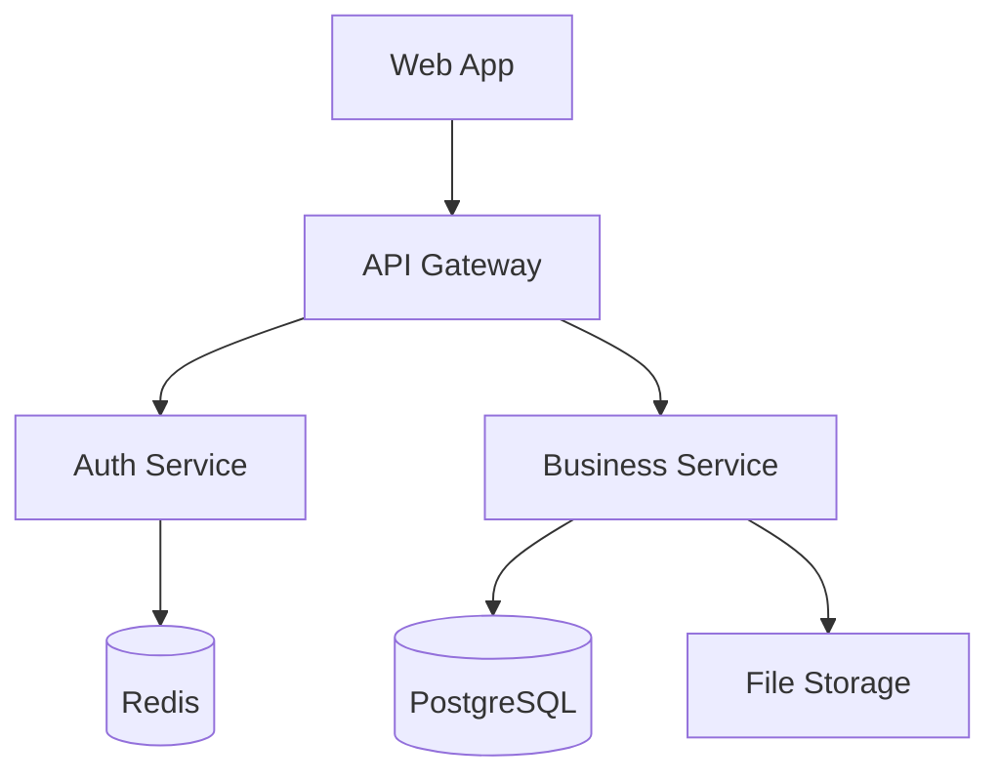
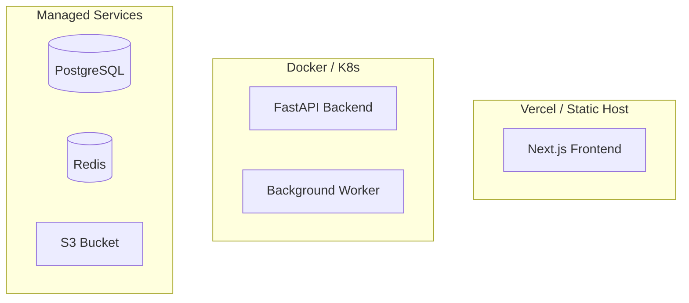
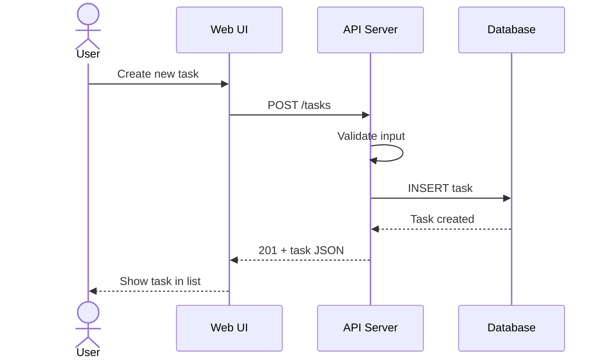

# Technical Research & Design

Pre-project technical research that transforms a raw idea into a structured, implementation-ready design document — covering requirements analysis, technology selection, high-level design, and detailed design.

This skill is the **first step** in the Ralph development pipeline. Its output feeds directly into the `prd` skill (PRD generation) and then the `ralph` skill (prd.json conversion).

---

## The Job

1. Receive a project idea or feature description from the user
2. Execute four sequential phases, confirming with the user after each phase
3. Produce a comprehensive technical research document at `tasks/tech-research-[project-name].md`

**Important:** Do NOT start implementing. Do NOT generate a PRD. This skill is about research and design — the output is a design document, not code and not a PRD.

---

## Relationship to Other Ralph Skills

```
User Idea → [research] → tech-research.md → [prd] → PRD → [ralph] → prd.json → Ralph Loop
             ↑ You are here                          ↑ Next step      ↑ Final prep
```

- **`prd` skill** (`skills/prd/SKILL.md`): Takes this research document and generates a user-story-focused PRD
- **`ralph` skill** (`skills/ralph/SKILL.md`): Converts the PRD into `prd.json` and configures ECC language rules

Your output should be detailed enough that the `prd` skill can extract clear user stories with verifiable acceptance criteria.

---

## How This Skill Works

You are a **coordinator**, not a standalone expert. For each phase, you bring in specialized reference skills that provide detailed frameworks and decision matrices. You orchestrate the workflow, while the reference skills supply domain expertise.

**Reference skill loading rule:**
- At the start of each phase, Read the listed reference skills to load their frameworks
- Apply their patterns to the current project, don't just restate them
- If a reference skill path doesn't exist (e.g., submodule not pulled), skip it and rely on your own knowledge — the phase structure alone should be sufficient

---

## Tool Chain (Harness Environment)

This skill runs inside the Harness metaproject. Use these tools for research:

| Tool | Use |
|------|-----|
| `mcp__plugin_ecc_exa__web_search_exa` | Technology research, competitive analysis, best practices |
| `mcp__plugin_ecc_context7__query-docs` | Library/framework API documentation (requires resolve-library-id first) |
| `mcp__plugin_ecc_github__search_code` | Open-source reference implementations |
| `python3 scripts/match_skills.py --json --top-k 5 "<query>"` | Discover additional skills if needed |
| `python3 scripts/match_cli.py --json --top-k 10 "<query>"` | Discover CLI tools relevant to the tech stack |

**DeepSeek API note:** Built-in WebSearch/WebFetch may not work. Use Exa MCP (`web_search_exa`) as the primary search tool. Fallback: `curl -sL` for simple page fetches.

---

## Phase 1: Requirements Analysis

**Goal:** Transform a vague idea into structured, verifiable requirements.

### Step 1.1: Clarify the Business Goal

Ask 3-5 critical questions to clarify what's ambiguous. Use A/B/C/D lettered options so the user can respond quickly (e.g., "1A, 2C, 3B"):

```
1. Who is the target user?
   A. General public (B2C)
   B. Business users (B2B)
   C. Internal team / admin
   D. Other: [please specify]

2. What is the primary problem this solves?
   A. Manual process automation
   B. Data visibility / reporting
   C. Communication / collaboration
   D. Other: [please specify]

3. What is the scope for initial release?
   A. Minimal viable product (MVP) — core flow only
   B. Full-featured v1 — all planned functionality
   C. Backend/API only — no UI
   D. UI prototype — no backend

4. What are the known constraints?
   A. Must integrate with existing system X
   B. Must run on-premise / private cloud
   C. Must comply with regulation Y
   D. No specific constraints
```

Ask only the questions where the user's initial prompt is ambiguous. Don't ask all 4 if the user already provided clear answers.

### Step 1.2: Identify User Personas & Scenarios

List every user role that interacts with the system. For each role, describe 1-2 core usage scenarios:

```
| Role | Description | Core Scenario |
|------|-------------|---------------|
| End User | ... | ... |
| Admin | ... | ... |
```

### Step 1.3: Map Functional Requirements

Numbered list, each item must be **verifiable** (can be answered with yes/no after implementation):

```
FR-1: Users can create an account with email and password
FR-2: Users can reset their password via email link
FR-3: ...
```

**Bad:** "FR-1: Good UX for login" (not verifiable)
**Good:** "FR-1: Login form shows validation errors inline without page reload"

### Step 1.4: Define Non-Functional Requirements

Cover the dimensions relevant to this project:

- **Performance:** Response time targets, concurrent user expectations
- **Security:** Authentication method, data sensitivity, compliance needs
- **Scalability:** Expected growth trajectory
- **Compatibility:** Browser/OS/device support
- **Maintainability:** Team size, expected longevity

If a dimension is irrelevant, note it and skip — don't invent requirements.

### Step 1.5: Set Scope Boundaries

Explicitly list what is **out of scope**. This prevents scope creep and helps the `prd` skill split user stories correctly:

```
Non-Goals:
- No mobile native app (web only for v1)
- No social login (email/password only)
- No real-time notifications (polling is acceptable)
```

### Reference Skills for Phase 1

Before starting this phase, Read:
- `subprojects/claude-skills-main/product-team/skills/product-discovery/SKILL.md` — Opportunity Solution Tree, assumption mapping, problem validation framework
- `subprojects/everything-claude-code/skills/product-lens/SKILL.md` — Product diagnostics, "why" validation, ICE scoring

---

## Phase 2: Technology Selection

**Goal:** Research and select the optimal technology stack with documented rationale.

### Step 2.1: Research Candidate Technologies

Use Exa MCP to search for:
- Frameworks and libraries in the relevant domain (e.g., "best frontend frameworks 2026 comparison")
- Real-world adoption and case studies
- Known limitations and common pitfalls

Use Context7 to pull up-to-date API documentation for top candidates.

### Step 2.2: Multi-Dimension Comparison

Evaluate each major technology choice across these dimensions:

| Dimension | Weight | What to Check |
|-----------|--------|---------------|
| Ecosystem Maturity | 25% | GitHub stars, npm/PyPI downloads, Stack Overflow questions, documentation quality, release cadence |
| Team Fit | 30% | Learning curve, existing team skills, hiring availability, training resources |
| Performance & Scalability | 20% | Benchmarks, real-world scaling stories, meets NFR targets |
| Maintenance Cost | 15% | Dependency count, breaking change history, community responsiveness, bus factor |
| License & Compliance | 10% | License type (MIT/Apache/GPL), security audit history, regulatory compliance |

Produce a comparison table for each major choice (frontend framework, backend framework, database, etc.).

**Adjust the weights** based on project context. A startup racing to MVP should increase "Team Fit" weight. A bank should increase "License & Compliance."

### Step 2.3: Write Architecture Decision Records

For each significant technology choice, write a brief ADR:

```
Decision: Use PostgreSQL as primary database
Rationale: Relational data model needed for financial transactions.
ACID compliance required per NFR-3. Team has 5+ years of PostgreSQL experience.
Alternatives considered: MySQL (no advantage over PostgreSQL), MongoDB (schema-flexible but weak on transactions)
```

### Step 2.4: Dependency Risk Analysis

Identify critical dependencies and their risks:

```
| Dependency | Risk | Mitigation |
|------------|------|------------|
| Next.js (Vercel) | Vendor lock-in, breaking changes | Export as static when possible, pin major version |
| Stripe (payments) | API deprecation, pricing changes | Abstract payment interface, keep Stripe SDK up to date |
```

### Reference Skills for Phase 2

Before starting this phase, Read:
- `subprojects/claude-skills-main/engineering-team/skills/tech-stack-evaluator/SKILL.md` — TCO analysis, ecosystem health scoring, security assessment, migration analysis
- `subprojects/everything-claude-code/skills/architecture-decision-records/SKILL.md` — ADR capture workflow, decision template

---

## Phase 3: High-Level Design

**Goal:** Define system architecture, module boundaries, and inter-module communication.

### Step 3.1: Choose Architecture Pattern

Select the architecture pattern based on project context:

| Team Size | Starting Point |
|-----------|---------------|
| 1-3 developers | Modular monolith |
| 4-10 developers | Modular monolith or service-oriented |
| 10+ developers | Consider microservices |

**Monolith when:** Team is small, domain boundaries are unclear, rapid iteration is priority, shared database is acceptable.

**Microservices when:** Teams own services independently, independent deployment is critical, different scaling needs per component, domain boundaries are well understood.

**Default recommendation:** Start with a modular monolith. Extract services only when specific scaling or team-independence needs arise.

### Step 3.2: Define Module/Service Boundaries

Draw a top-level module map. Each module gets a one-sentence responsibility statement:

```
┌─────────────────────────────────────────┐
│  Web UI (React/Next.js)                  │
│  Pages, components, client state         │
└──────────────┬──────────────────────────┘
               │ REST API (JSON)
┌──────────────▼──────────────────────────┐
│  API Server (FastAPI/Express/Go)         │
│  Auth, validation, business logic        │
└──────┬──────────┬──────────┬────────────┘
       │          │          │
┌──────▼──┐ ┌─────▼────┐ ┌─▼──────────┐
│ Auth DB │ │ Main DB  │ │ File Store  │
│(Redis)  │ │(Postgres)│ │ (S3/MinIO)  │
└─────────┘ └──────────┘ └─────────────┘
```

### Step 3.3: Design Data Flows

Describe the main data flow paths:

1. **Read path:** User → Web UI → API → Database → API → Web UI
2. **Write path:** User → Web UI → API → Validate → Database → Response → Web UI
3. **Async path (if applicable):** API → Message Queue → Worker → External Service → Database

### Step 3.4: Define Interface Contracts (Summary)

Choose the API style and list major endpoints:

```
API Style: REST (JSON)
Base URL: /api/v1/

Endpoints:
- POST   /auth/login          — Authenticate user, return JWT
- POST   /auth/register       — Create new account
- GET    /items               — List items (paginated, filterable)
- GET    /items/:id           — Get single item
- POST   /items               — Create item
- PATCH  /items/:id           — Update item
- DELETE /items/:id           — Delete item
```

### Step 3.5: Draw Architecture Diagrams

Use Mermaid for diagrams (renders natively in markdown, no external tools needed):

**Component Diagram:**


**Deployment Diagram** (if infrastructure decisions are made):


### Reference Skills for Phase 3

Before starting this phase, Read:
- `subprojects/claude-skills-main/engineering-team/skills/senior-architect/SKILL.md` — Architecture pattern selection matrix, database selection workflow, monolith vs. microservices decision checklist
- `subprojects/everything-claude-code/skills/hexagonal-architecture/SKILL.md` — Ports & Adapters pattern, domain boundary definition, dependency inversion

---

## Phase 4: Detailed Design

**Goal:** Go deep on the 2-3 most critical modules — enough detail for the `prd` skill to extract implementable user stories.

### Step 4.1: Deep-Dive on Core Modules

Pick the 2-3 modules that are most critical or most complex. For each module:

- **Responsibility:** One-sentence statement
- **Key components/classes:** File name, purpose, key methods
- **State management** (frontend): What state, where it lives, how it's updated
- **Business logic flow** (backend): Step-by-step flow of the main operation

**⚠️ Don't design every module.** Focus on the ones where design ambiguity would cause implementation problems. Less critical modules can be designed during implementation.

### Step 4.2: Design Data Model

Define the core entities, fields, and relationships:

```
User
  id: UUID (PK)
  email: string (unique, not null)
  password_hash: string (not null)
  created_at: timestamp
  updated_at: timestamp

Task
  id: UUID (PK)
  user_id: UUID (FK → User.id)
  title: string (not null)
  status: enum(pending, in_progress, done)
  priority: enum(high, medium, low)
  created_at: timestamp
  updated_at: timestamp

Relationship: User 1──N Task
```

Include an ER diagram in Mermaid for clarity.

### Step 4.3: Specify API Contracts in Detail

For each core endpoint, define the full request/response contract:

```
POST /api/v1/tasks
  Request:
    Headers: Authorization: Bearer <jwt>
    Body: { "title": "string", "priority": "high|medium|low" }
  Response 201:
    Body: { "id": "uuid", "title": "string", "status": "pending", ... }
  Response 400:
    Body: { "error": "validation_error", "details": [...] }
  Response 401:
    Body: { "error": "unauthorized" }
```

### Step 4.4: Sequence Diagrams for Critical Flows

Draw 2-3 sequence diagrams for the most important user interactions:



### Step 4.5: Security & Edge Cases

Address these for every user-facing surface:

- **Authentication/Authorization:** What auth mechanism? What roles/permissions?
- **Input Validation:** Where does validation happen? What rules?
- **Error States:** What does the user see on network failure? On server error?
- **Empty States:** What does the user see when there's no data?
- **Loading States:** What does the user see while data loads?
- **Trust Boundaries:** Where does untrusted data enter the system?

### Reference Skills for Phase 4

Before starting this phase, Read:
- `subprojects/claude-skills-main/engineering/skills/spec-driven-workflow/SKILL.md` — RFC 2119 requirements writing (MUST/SHOULD/MAY), Given/When/Then acceptance criteria format, spec document structure
- `subprojects/everything-claude-code/skills/api-design/SKILL.md` — REST API design patterns: resource naming, status codes, pagination, filtering, error response format, versioning
- `subprojects/claude-skills-main/engineering/skills/database-designer/SKILL.md` — Schema design, normalization analysis, index strategy, zero-downtime migration patterns, ERD generation
- `subprojects/everything-claude-code/skills/product-capability/SKILL.md` — Capability constraints extraction: invariants, trust boundaries, data ownership, lifecycle transitions, failure/recovery expectations

---

## Output Format

Save to `tasks/tech-research-[project-name].md` (kebab-case project name):

```markdown
# Technical Research Report: [Project Name]

## 1. Requirements Analysis
### 1.1 Business Goal
### 1.2 User Personas & Scenarios
### 1.3 Functional Requirements (FR-1..N)
### 1.4 Non-Functional Requirements
### 1.5 Scope & Non-Goals

## 2. Technology Selection
### 2.1 Candidate Research
### 2.2 Multi-Dimension Comparison
### 2.3 Final Technology Stack
### 2.4 Architecture Decision Records
### 2.5 Dependency Risk Analysis

## 3. High-Level Design
### 3.1 Architecture Pattern
### 3.2 Module Boundaries
### 3.3 Data Flow Design
### 3.4 Interface Contracts (Summary)
### 3.5 Architecture Diagrams

## 4. Detailed Design
### 4.1 Core Module Design (2-3 modules)
### 4.2 Data Model
### 4.3 API Contract Specifications
### 4.4 Sequence Diagrams
### 4.5 Security & Edge Cases

## 5. Open Questions

## 6. Next Steps
→ Use `prd` skill to generate a Product Requirements Document from this report.
→ Then use `ralph` skill to convert the PRD to prd.json for Ralph autonomous execution.
```

---

## Interaction Rules

1. **Progressive confirmation:** After completing each phase, present the results and ask: "Phase N complete. Continue to Phase N+1, revise this phase, or skip?"
2. **Skip support:** If the user already has clear requirements, they can skip Phase 1. If they have a fixed tech stack, they can skip Phase 2. Always confirm before skipping.
3. **A/B/C/D question format:** When asking clarifying questions, use lettered options (see Phase 1 format). This lets users respond with "1A, 2C, 3B."
4. **No implementation:** If the user asks you to start coding, remind them: "This skill produces design documents. Use the `prd` skill next, then `ralph` to start the Ralph autonomous build loop."

---

## Example: Task Management Web App

**User says:** "I want to build a task management web app for small teams."

### Phase 1 Output (Abbreviated)

**Clarifying questions:**

1. What is the primary differentiator from existing tools like Trello/Asana?
   A. Simpler UX with fewer features
   B. Better real-time collaboration
   C. Integrated time tracking and billing
   D. Other: [please specify]

2. What is the target team size?
   A. 1-5 people
   B. 5-20 people
   C. 20-100 people
   D. 100+ people

*User responds: "1A, 2A"*

**Personas:**
| Role | Description | Core Scenario |
|------|-------------|---------------|
| Team Member | Creates and manages own tasks | Create task, mark done, reorder by priority |
| Team Lead | Oversees team's work | View all team tasks, assign tasks, see progress |

**Functional Requirements (excerpt):**
- FR-1: Users can create tasks with title, priority (high/medium/low), and optional description
- FR-2: Users can drag-and-drop tasks to reorder within a list
- FR-3: Tasks support three statuses: pending, in_progress, done
- FR-4: Team lead can filter tasks by assignee and status

### Phase 2 Output (Abbreviated)

**Final Technology Stack:**
| Layer | Choice | Rationale |
|-------|--------|-----------|
| Frontend | React + Vite | Team knows React, Vite is fast and simple |
| Backend | FastAPI (Python) | Lightweight, async support, good docs |
| Database | PostgreSQL | Relational data, strong consistency |
| ORM | SQLAlchemy 2.0 | Mature, async support |
| Auth | JWT + bcrypt | Stateless, simple to implement |
| Deployment | Docker Compose | Simple for small team, no K8s needed |

### Phase 3 Output (Abbreviated)

**Architecture:** Modular monolith (team of 1-3, rapid iteration)

**Modules:**
| Module | Responsibility |
|--------|---------------|
| `auth` | Registration, login, JWT management |
| `tasks` | CRUD, reordering, filtering |
| `teams` | Team membership, roles |

### Phase 4 Output (Abbreviated)

**Data Model (excerpt):**
```
Task
  id: UUID (PK)
  team_id: UUID (FK → Team.id)
  creator_id: UUID (FK → User.id)
  assignee_id: UUID (FK → User.id, nullable)
  title: string (not null, max 200)
  status: enum(pending, in_progress, done)
  priority: enum(high, medium, low)
  position: integer (for drag-and-drop ordering)
  created_at: timestamp
  updated_at: timestamp
```

**API Contract (excerpt):**
```
POST /api/v1/tasks
  Body: { "title": "string", "priority": "high|medium|low", "assignee_id?": "uuid" }
  Response 201: { "id": "uuid", "title": "...", "status": "pending", ... }
```

---

## Checklist Before Saving

Before writing the final document, verify:

- [ ] Phase 1: User personas are specific (not "user" — "team member" and "team lead")
- [ ] Phase 1: Every functional requirement is verifiable (not vague)
- [ ] Phase 1: Non-goals are explicitly listed
- [ ] Phase 2: At least one ADR for each major technology choice
- [ ] Phase 2: Comparison tables include weights, not just checkmarks
- [ ] Phase 2: Dependency risks are identified with mitigations
- [ ] Phase 3: Architecture pattern has a clear rationale (not just "we chose microservices")
- [ ] Phase 3: Module boundaries are clear — each module has one responsibility
- [ ] Phase 3: At least one Mermaid architecture diagram
- [ ] Phase 4: Data model covers all entities from Phase 1 functional requirements
- [ ] Phase 4: At least one API endpoint is fully specified (request + response + errors)
- [ ] Phase 4: At least one Mermaid sequence diagram for a critical flow
- [ ] Phase 4: Security and edge cases are addressed (auth, validation, empty/error/loading states)
- [ ] Document saved to `tasks/tech-research-[project-name].md`
- [ ] Output is ready for the `prd` skill to consume
